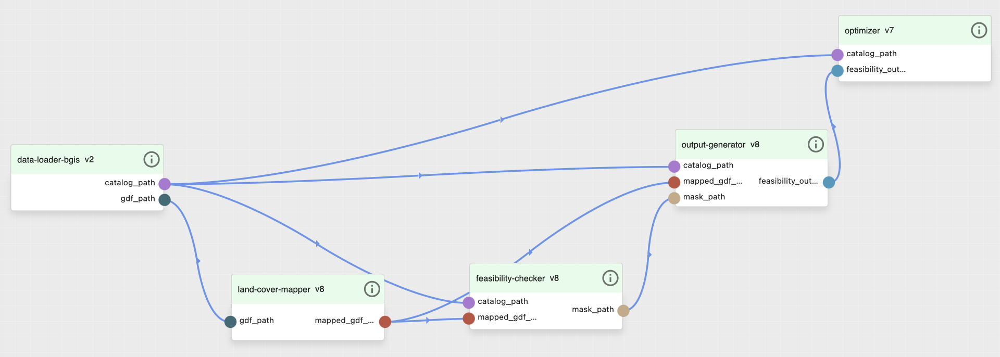
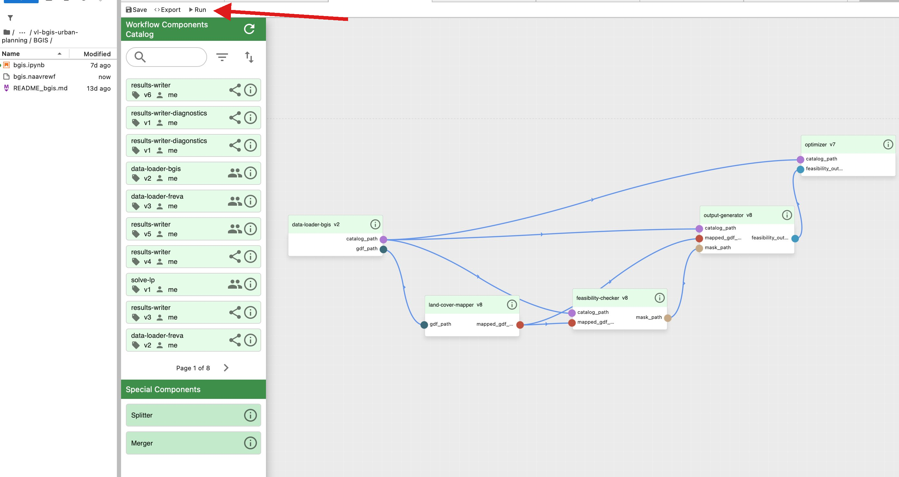
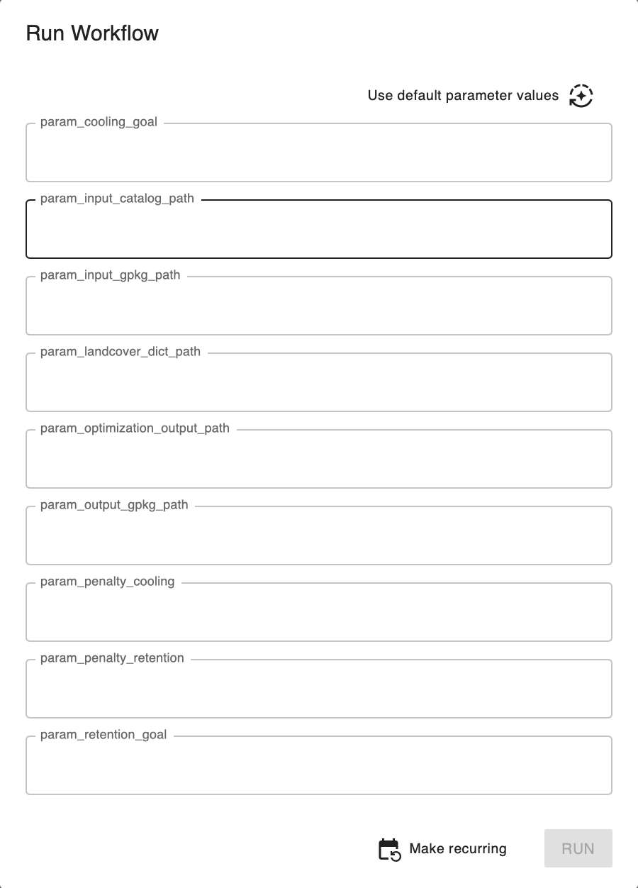
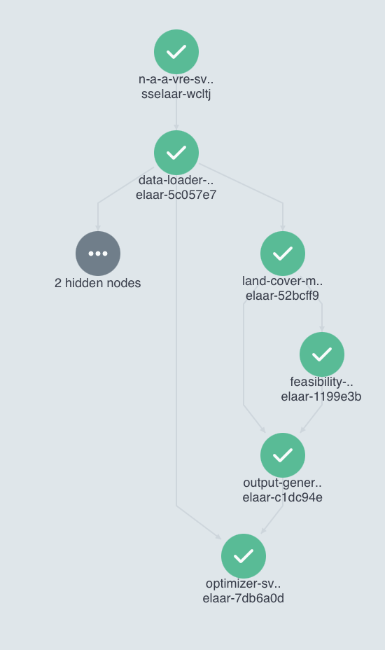

# Tutorial: running a workflow in the BGIS Urban Planning Virtual Lab

This walks you through running one of the two workflows end to end, from opening the
Virtual Lab to finding your output file. It is written for someone who has not used
NaaVRE before. No coding is needed and you do not edit the notebooks to run anything.

By the end you will have run the BGIS workflow on its example dataset and located the
result in your own storage. FreVA works the same way, with different parameters, and is
covered briefly at the end.

For the parameters and outputs of each workflow in full, see
[BGIS/README_bgis.md](BGIS/README_bgis.md) and [FReVA/README_freva.md](FReVA/README_freva.md).

## 1. Get access

Open the Virtual Lab in your browser and log in:

<https://beta.naavre.net/vreapp/vl/bgis-urban-planning>

You need to be a member of the `bgis-urban-planning` Virtual Lab. If the link does not
open, or you cannot log in, email Sven (address at the bottom) to be added.

Once you are in, you are looking at a JupyterLab environment with a file browser on the
left. The workflow files and the sample data are reachable from here.

## 2. Open the workflow

In the file browser, open the `BGIS` folder and double-click `bgis.naavrewf`. This opens
the workflow editor, not a notebook. You will see the five BGIS cells laid out and
connected.

> The `.naavrewf` files are the workflows you run. The `.ipynb` notebooks next to them are
> the source, kept for reference. You do not need to open or run the notebooks.



## 3. Run it

The **Run** control is at the top of the workflow editor. This is the step most people
miss on their first try, so look along the top toolbar of the editor pane.



Click **Run**. A dialog opens with the workflow parameters. For a first run, leave every
value at its default. The defaults point at the example dataset that ships in the public
storage, so you do not have to upload anything.



Click **Run** again in the dialog to submit. You should see a `Workflow submitted!`
message.

## 4. Watch it run

In the confirmation, click **Show in workflow engine**. This opens the run view, where
each cell appears as a node. A green tick means a cell has finished. When every node is
green, the run is done.



A first run can take several minutes. Most of that is the platform starting a fresh
container for each cell, not the computation itself, so do not be alarmed if a small
dataset still takes a few minutes.

## 5. Find your output

Outputs are written to your own storage area:

```
/home/jovyan/Cloud Storage/naa-vre-user-data/
```

You reach it from the JupyterLab file browser, under `Cloud Storage` then
`naa-vre-user-data`. For the BGIS run with default parameters you will find:

| File | What it is |
|------|------------|
| `testing_standalone.gpkg` | Feasibility result, one column per BGI type (1 = feasible) |
| `bgis_optimization_result.gpkg` | The selected BGI per parcel |
| `bgis_optimization_result_map.png` | A map of the selection |

Open the `.png` directly in JupyterLab to get a quick look. For the full interactive
result, download a `.gpkg` and open it in QGIS. The symbology steps are in
[BGIS/README_bgis.md](BGIS/README_bgis.md) under "Viewing the output".

## 6. Run FreVA

FreVA is the same procedure with a different workflow. Open `FReVA/freva.naavrewf`, click
**Run**, accept the defaults (the China dataset with the profit objective) and submit. The
outputs land in the same `naa-vre-user-data/` area:

| File | What it is |
|------|------------|
| `freva_results.csv` | One row per non-zero allocation, listing which food-loss stream goes to which chemical, the flow, the yield and the amount of chemical produced |
| `freva_summary.json` | The objective value, the solver status, and per-stream and per-chemical totals |

The parameters (region, objective, input path, output paths) are described in
[FReVA/README_freva.md](FReVA/README_freva.md).

## 7. Run with your own data

To use your own input instead of the example:

1. Drag your file into `naa-vre-user-data/` in the JupyterLab file browser.
2. Open the workflow and click **Run**.
3. In the parameter dialog, set the relevant input path parameter to your file
   (`param_input_gpkg_path` for BGIS, `param_input_xlsx_path` for FreVA).
4. Submit.

Your file has to follow the same structure as the example. The READMEs describe the
expected columns and sheets.

## Troubleshooting

**I cannot find the Run button.** It is on the toolbar at the top of the workflow editor
pane, not in the left file browser and not a right-click option. See the screenshot in
step 3.

**My output is not where I expected.** Outputs go to `naa-vre-user-data/`, never to the
folder you opened the workflow from. Check the path each parameter points at in the run
dialog; that is exactly where the file is written.

**A run is taking several minutes on a tiny dataset.** That is normal. The time is mostly
container startup, which does not depend on how large your data is. The very first run
after a quiet period is the slowest because the container image has to be pulled.

**I ran two workflows at once and one failed with a read-only database error.** Run one
workflow at a time when they write to the same output path. A GeoPackage needs a write
lock even to be read, and concurrent runs on the shared storage can collide. Giving each
run its own output path also avoids this.

**I re-ran the workflow but the output file's timestamp did not change.** On this storage
mount the displayed modification time is not always updated when a file is overwritten
with the same name. The file contents are still written. Trust the contents, not the
timestamp.

## Screenshots to add

This file references five images under `docs/img/`. Capture them once and commit them:

- `workflow_editor.png` (the workflow open in the editor)
- `run_button.png` (the toolbar with the Run control, ideally circled)
- `parameter_dialog.png` (the parameter dialog)
- `workflow_engine_complete.png` (a finished run, all nodes green)
- and reuse the canvas figures from the thesis if you have them to hand

## Contact

- Sven Tesselaar (migration): <sven.tesselaar@student.uva.nl>
- Dr. Zhiming Zhao (supervisor): <z.zhao@uva.nl>
